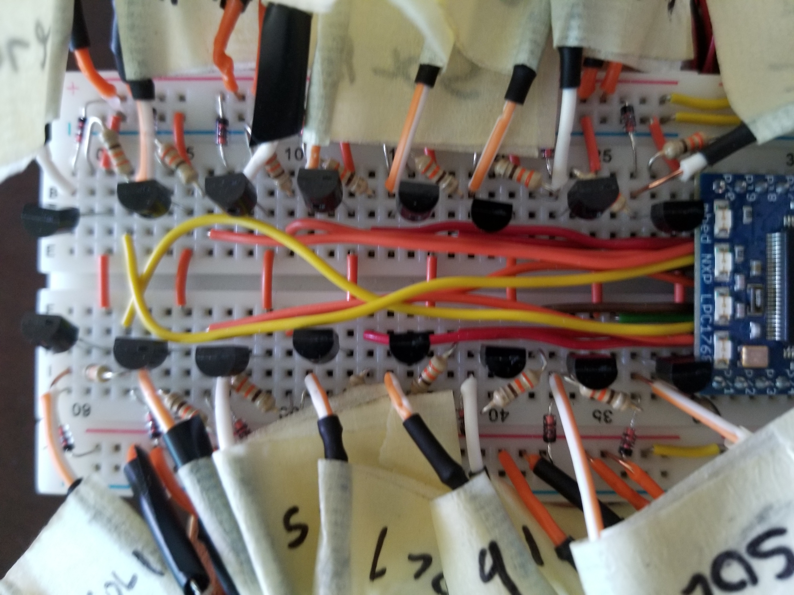

# AutoUke
Utilizes an ARM Mbed microcontroller and solenoids to automatically play a ukelele.

## Features

### Solenoids
The Mbed is connected to 16 inductive switching circuits to activate and deactivate 16 solenoids. Each inductive switching circuit utilizes a 2N100 n-channel mosfet and 1N4148 diode to switch on and off each solenoid. The solenoids are rated for use at 12 volts and 125 mA. However, I only use them
at 9 volts, as the solenoids full strength is not needed to push down the strings. The solenoids are arranged in a 4x4 array, so that each of the 4 strings on a ukelele can be pressed to one of 5 positions (unpressed is also a position). This allows the ukelele strings to be pressed to one of 625 unique chords. The most common 180 of these chords are supported in the software (See SD File Reader section).

### SD File Reader
An SD card slot is connected to the mbed to read a text file that contains tabs for the song to be played. The tabs are written in common musical tablature format. For example, A major would be written as simply A, G sharp minor would be G#m. The tab file contains a list of chords separated by commas. Any number of sharps (#) or flats (b) can be added to the base note of the chord to raise it by a half step (Double sharps/flats are OK!). Below is a table with the software supported chords. 

|Root chords:|A|A#/Bb|B|B#/C|C#/Db|D|D#/Eb|E|E#/F|F#/Gb|G|G#/Ab|
|Supported chords:|Major|Minor|Augmented|Diminished|Dominant 7th|Minor 7th|Major 7th|Major 6th|Minor 6th|Add 9|Minor 9th|Major 9th|Sus 2|Sus 4|7 Sus 4| 
|Example Notation:|A|Am|Aaug|Adim|A7|Am7|AMaj7|AMaj6|Am6|Aadd9|Am9|Amaj9|Asus2|Asus4|A7sus4| 

#### Example Tab file

To create a tab file, make a new text file in the root directory of the SD card called "tab.txt." 
Here's some example tab files:

"Four chords":

```
4,C,G,A,F
```

"Fly me to the moon"

```
3,Am,Am,Dm,Dm,G7,G7,Cmaj7,C7,F,F,Dm,Dm,Em7,Em7,Am7,A7,Dm,Dm,G7,G7,Em7,Em7,Am7,Am7,Dm,Dm,G7,G7,Cmaj7,Cmaj7,E7,E7
```

### Metronome
The four mbed led's will flash like a metronome. The metronome has 5 "modes" that roughly correspond to different time signatures. At the begining of the tab file, include a number 0-4 followed by a comma to indicate time signature. This will affect the pattern of lights that displays on the Mbed's leds, and can also affect the speed at which the chords change, as they will always change after every beat.

0. Four/Four mode (Default)
1. Three/Four mode
2. Six/Eight mode
3. "Eighth note" mode
4. "Sixtheenth note" mode

### Potentiometer
The potentiometer can be used to adjust the tempo, or turn off the device. The supported tempo ranges from about 25 beats per minute to 200 beats per minute. Moving the potentiometer to the lowest setting will turn off and reset the device. This will also give the user an opportunity to change the song by switching the SD card, or just to start from the begining again. 


## RTOS?
We did not use the MBed RTOS for this lab. RTOS may seem like a natural fit for this kind of project, since there are multiple different hardware elements that need to be managed at timer increments. However, because of the rhythmic nature of the machine, they are all done in a deterministic, periodic way. So, there was no reason to include an rtos. 

## Video Demo

[](http://www.youtube.com/watch?v=ppW-VwZQIFY)

## Development Pictures




More pictures in the media folder